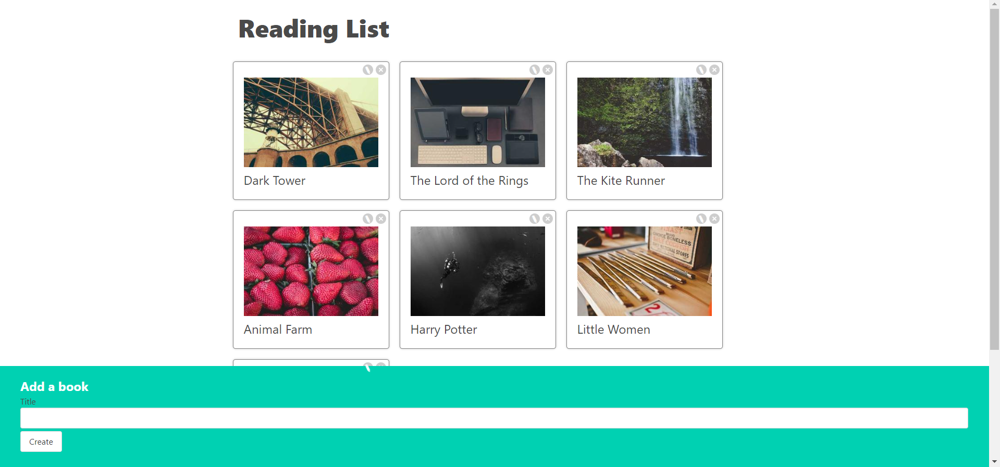

# React Reading List

A simple react project with CRUD functionality on list of some books.

This project was developed while spending the [Modern React with Redux](https://www.udemy.com/course/react-redux/) course on udemy.

The purpose of this project is learn the basics of React concepts like:
- State Management
- Context API
- Conditional Rendering
- Form Handling
- Using built-in and custom hooks
- Communicate with backend server

Theses concepts are used inside enterprise projects also.

Although it's better to use external tools such as redux to manage global state and data, but in this project you will learn how to manage state change correctly so you better understand those external tools


## Overview



## What application does

- Read list of books from [json-server](https://www.npmjs.com/package/json-server) (can be any backend system) at the first time rendering

- Get a random image from [Lorem Picsum](https://picsum.photos/) for each book item

- Get input title from user and add to global context and also add to json server database

- Edit and delete the existing book titles


## Installation

```
    # clone project in your local machine
    git clone https://github.com/alborzasd/react-reading-list.git

    # change directory to the project
    cd react-reading-lsit

    # install required packages
    npm install

    # run json-server
    npm run server

    # run react development server
    npm start
```
